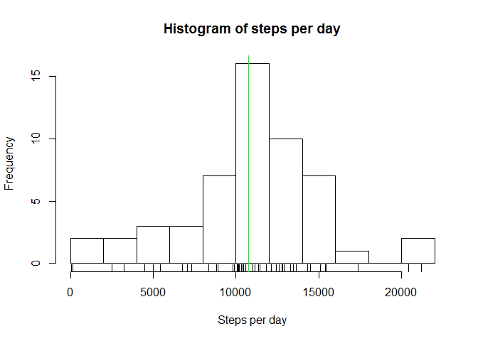
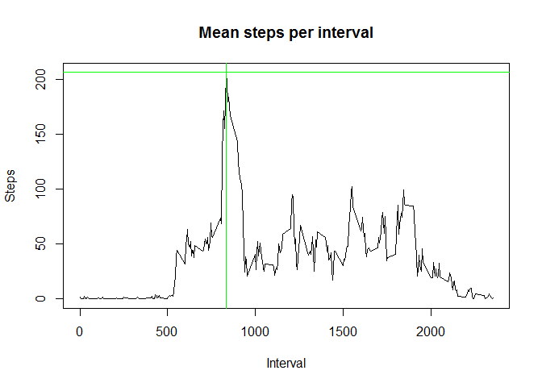

# Reproducible Research: Peer Assessment 1


## Loading and preprocessing the data

```r
## Download and unzip the data, if necessary, before loading it into dataframe activity
if(!file.exists("activity.csv")) {
    if(!file.exists("activity.zip")) {
        print("Downloading data")
        download.file("http://d396qusza40orc.cloudfront.net/repdata%2Fdata%2Factivity.zip",
                      "activity.zip")
    }
    print("Unzipping data")
    unzip("activity.zip", files=c("activity.csv"))
}
print("Reading data")
```

```
## [1] "Reading data"
```

```r
activity<-read.csv("activity.csv")
```
## What is mean total number of steps taken per day?

```r
options(scipen=1, digits=4)
library(dplyr)
```

```
## Warning: package 'dplyr' was built under R version 3.1.3
```

```
## 
## Attaching package: 'dplyr'
## 
## The following object is masked from 'package:stats':
## 
##     filter
## 
## The following objects are masked from 'package:base':
## 
##     intersect, setdiff, setequal, union
```

```r
## Take the sum of steps for each day, in data frame stepsday
stepsday<-summarise(group_by(activity, date), steps=sum(steps))
## Create a histogram, with rug
hist(stepsday$steps, breaks=8, main="Histogram of steps per day", xlab="Steps per day")
rug(stepsday$steps)
## Calculate the mean and median steps per day, and mark them on the histogram
mn=mean(stepsday$steps, na.rm=TRUE)
med=median(stepsday$steps, na.rm=TRUE)
abline(v=mn, col="red")
abline(v=med, col="green")
```

 
  
  
The mean number of steps per day is 10766.1887.  
The median number of steps per day is 10765.


## What is the average daily activity pattern?

```r
## Take the mean steps per interval, in dataframe stepsint, and plot it.
stepsint<-summarise(group_by(activity, interval), steps=mean(steps, na.rm=TRUE))
plot(stepsint$interval,stepsint$steps,type='l',
     main="Mean steps per interval",
     xlab="Interval", 
     ylab="Steps")
## Find the max of the mean steps per interval across all intervals, as well as the first
## interval in which it occurs.  Add lines to the plot marking these.
mx=max(stepsint$steps)
mxint=stepsint[which.max(stepsint$steps),1]
abline(h=mx, col="green")
abline(v=mxint, col="green")
```

 
  
The maximum average number of steps per interval is 206.1698.  
This maximum occurred at interval 835.


## Imputing missing values

```r
## Count the number of NAs, and find out which days contain NAs
countnas=sum(is.na(activity$steps))
dayswithnas=unique(activity[is.na(activity$steps), c("date")])
## Store a piece of text for later display if it is only whole days that are missing
if(countnas/length(dayswithnas)==24*12) {
    show.text<-"In fact, as the number of missing values divided by the number of days that have 
    missing values equals 288 (or 24 hours times 12 five minute intervals), it must be that the 
    data set contains only whole days that are missing."
}
```
There are 2304 missing values.  
Those missing values are distributed over the following 8 days: 2012-10-01, 2012-10-08, 2012-11-01, 2012-11-04, 2012-11-09, 2012-11-10, 2012-11-14, 2012-11-30.  
In fact, as the number of missing values divided by the number of days that have 
    missing values equals 288 (or 24 hours times 12 five minute intervals), it must be that the 
    data set contains only whole days that are missing.  
  
  
The missing step counts will be replaced with the mean step count for that interval over the entire period.  This will have the effect of replacing all the missing days with an "average" day, but it will also skew the statistics for steps per interval and steps per days toward the mean (e.g., median will move toward the mean, standard deviation will decrease).


```r
## In a new dataframe imputed, replace NAs with the average number of steps taken during
## that interval across other days, as previously calculated in dataframe stepsint
imputed<-activity
naindx<-is.na(imputed$steps)
imputed[naindx,c("steps")]<-stepsint[match(imputed[naindx, c("interval")], 
                                          stepsint$interval), 
                                    c("steps")]
## Recaculate the number of steps per day with the imputed data, and regenerate the 
## histogram from earlier
stepsday<-summarise(group_by(imputed, date), steps=sum(steps))
hist(stepsday$steps, breaks=8, 
     main="Histogram of steps per day (with imputed values)", 
     xlab="Steps per day")
rug(stepsday$steps)
mn=mean(stepsday$steps, na.rm=TRUE)
med=median(stepsday$steps, na.rm=TRUE)
abline(v=mn, col="red")
abline(v=med, col="green")
```

 

The mean number of steps per day (with imputed values) is 10766.1887.  
The median number of steps per day (with imputed values) is 10766.1887.  
The method of replacing missing values chosen has had the effect of adding eight days with exactly the mean number of steps to the total.  While this does not change the mean steps per day, it has affected the median.  Eight additional days with exactly the mean number of steps per day was sufficient to ensure that the median equals the mean.  
In terms of the histogram, the highest bar, which already contained the mean, has increased by eight.  

## Are there differences in activity patterns between weekdays and weekends?
  
 

```r
library(lattice)
## Create a new factor distinguishing between weekdays and weekend-days
imputed$weekday<-ifelse(weekdays(as.Date(imputed$date)) %in% 
                            c("Saturday","Sunday"), "weekend", "weekday")
imputed$weekday<-as.factor(imputed$weekday)
## Calculate and plot the average steps per interval for weekends and weekdays
stepsweekday<-summarise(group_by(imputed, weekday,interval), steps=mean(steps))
xyplot(steps~interval|weekday,data=stepsweekday,type='l',layout=c(1,2))
```

 

As you can see, on average weekday activity starts earlier in the morning and reaches a higher peak around 9:00 A.M. before tapering off and remaining relatively low for the rest of the day.  Activity on the weekend starts a litte later, and while it also peaks in the morning it remains relatively high through the day, and tapers off a little later in the evening.
